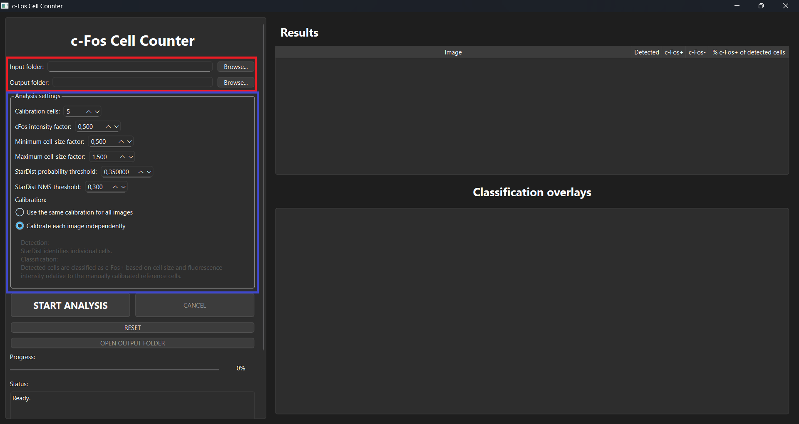
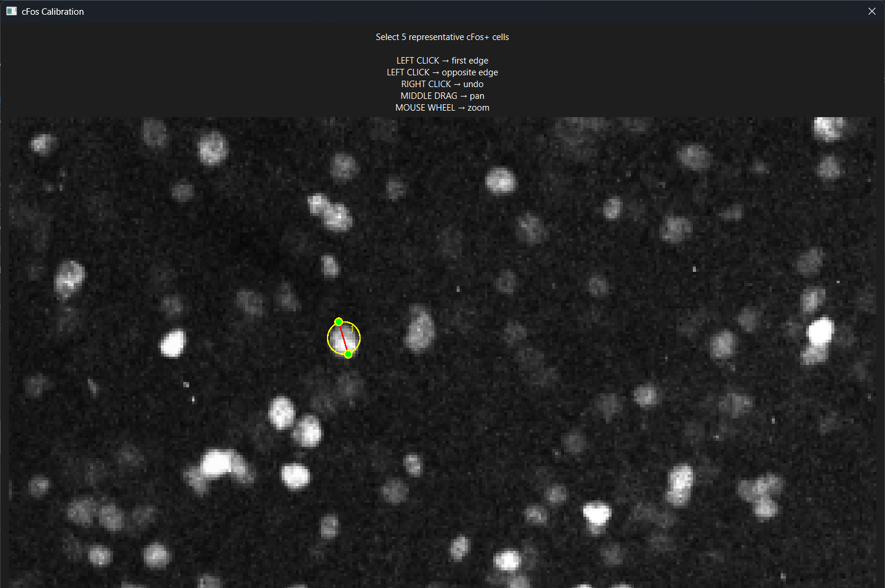
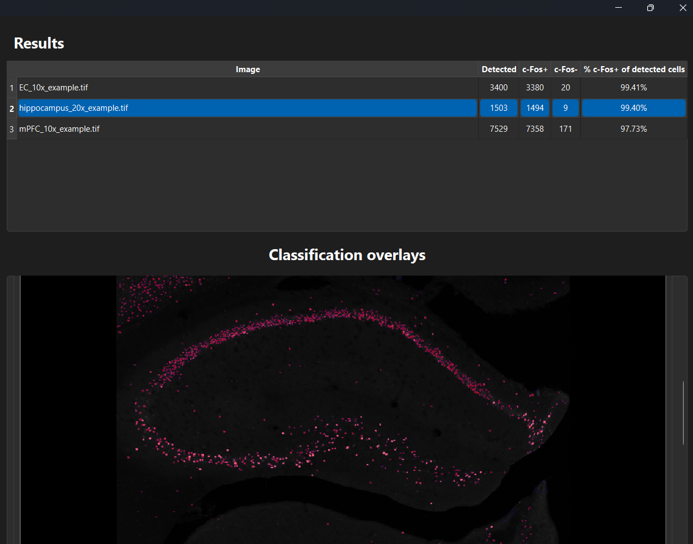
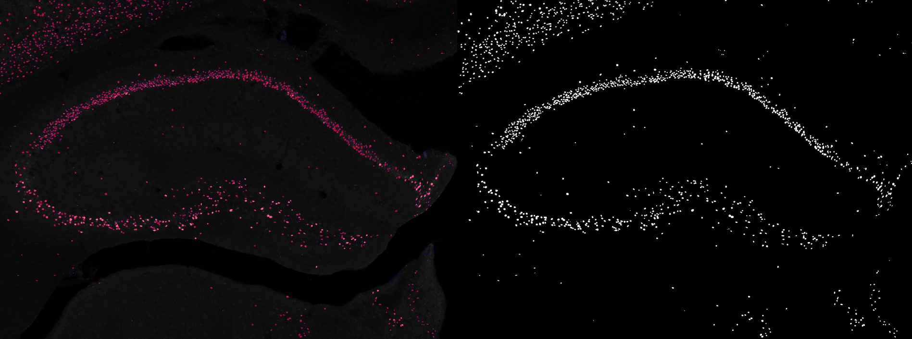
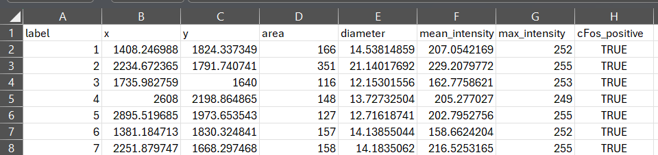

# c-Fos Cell Counter

A Python application for automated detection and quantification of c-Fos-positive (c-Fos+) cells in fluorescence TIFF images.
The application uses [StarDist](https://github.com/stardist/stardist) for cell detection and provides an interactive calibration procedure for classification of detected cells based on fluorescence intensity and cell area.

## Features

* Automated cell detection using StarDist
* Detection of c-Fos+ and c-Fos- cells
* Interactive manual calibration
* Automatic analysis of multiple TIFF images
* Visual overlay of cell classification
* Export of analysis results
* Windows standalone executable available

## Installation

There are two ways to use c-Fos Cell Counter.

### Option 1 - Windows executable

The easiest option for Windows users is to download the latest release:

**[Download the latest Windows release](../../releases/latest)**

Download the ZIP file, extract it, and run:

```text
c-Fos_Cell_Counter.exe
```

Python and Conda are not required when using the standalone Windows version.

### Option 2 - Run from Python

This option is intended for users who want to run or modify the source code.

#### Requirements

* Anaconda or Miniconda
* Python 3.9

#### Create the environment

Clone the repository:

```bash
git clone https://github.com/StefanoGuglielmo/c-Fos_Cell_Counter.git
cd c-Fos_Cell_Counter
```

Create the Conda environment:

```bash
conda env create -f environment.yml
```

Activate it:

```bash
conda activate cfos_counter
```

Run the application:

```bash
python app.py
```

## Example data

Example TIFF images are provided in:

```text
example/input/
```

## Model

The application uses the StarDist `2D_versatile_fluo` model for cell detection.
The model configuration and weights required by the application are included in:

```text
model/2D_versatile_fluo/
```

## Workflow

The analysis follows a simple workflow, from image selection and calibration to cell detection, classification, and export of the results:

1. Select the input and output folders.
2. Configure the analysis parameters.
3. Manually calibrate the analysis using representative c-Fos-positive cells.
4. Detect cells using StarDist.
5. Classify the detected cells as c-Fos-positive or c-Fos-negative.
6. Inspect the classification using the generated overlays.
7. Export the image and cell-level results.

## Usage

### 1. Configure the analysis

After opening the application, select the **input folder** containing the fluorescence images to be analyzed and the **output folder** where the results will be saved (red square).
The input images must be **TIFF files containing a single channel and a single Z-plane**.
The analysis can be configured using the parameters shown in the **Analysis settings** panel (blue square).



#### Calibration cells

**Calibration cells** specifies the number of representative c-Fos-positive cells that will be manually selected during calibration. These cells are used to determine the reference cell diameter and fluorescence intensity. A larger number of reference cells can provide a more representative calibration, but requires additional manual selections.
**For datasets containing a large number of images or images acquired under different imaging conditions, individual calibration for each image is recommended.**

#### c-Fos intensity factor

**c-Fos intensity factor** determines the fluorescence intensity threshold used for c-Fos classification. The threshold is calculated as: `reference intensity x c-Fos intensity factor`

For example, a factor of `0.50` means that a detected cell must have a mean fluorescence intensity at least 50% of the reference intensity to pass the intensity criterion. Lower values make the intensity criterion less restrictive, while higher values make it more restrictive.

#### Minimum cell-size factor

**Minimum cell-size factor** defines the minimum allowed cell diameter relative to the reference cell diameter. The minimum diameter is calculated as: `reference diameter x minimum cell-size factor`

Cells smaller than this threshold cannot be classified as c-Fos-positive. Lower values allow smaller cells to be classified as positive, while higher values exclude more small cells.

#### Maximum cell-size factor

**Maximum cell-size factor** defines the maximum allowed cell diameter relative to the reference cell diameter. The maximum diameter is calculated as: `reference diameter x maximum cell-size factor`

Cells larger than this threshold cannot be classified as c-Fos-positive. Lower values exclude more large cells, while higher values allow larger cells to be classified as positive.

#### StarDist probability threshold

**StarDist probability threshold** controls the minimum confidence required for StarDist to accept a detected cell. Lower values allow more potential cells to be detected, but may increase false detections. Higher values make detection more conservative and may exclude weaker or difficult-to-detect cells.

#### StarDist NMS threshold

**StarDist NMS threshold** controls how overlapping cell detections are handled. Lower values apply stronger suppression of overlapping detections, while higher values allow more overlapping detections to be retained.

#### Calibration mode

The application provides two calibration modes:

- **Use the same calibration for all images** - the first image is manually calibrated, and the resulting reference diameter and intensity are applied to all images. This is recommended when images were acquired under comparable imaging conditions.
- **Calibrate each image independently** - each image is manually calibrated separately. This can be useful when images differ in fluorescence intensity or cell size.

### 2. Manual c-Fos calibration

During calibration, select representative **c-Fos-positive cells** in the image. For each reference cell, left-click on one edge of the cell and then left-click on the opposite edge to define its diameter. The application measures the diameter and fluorescence intensity of the selected cells. The measurements from the reference cells are then used to determine the reference diameter and reference intensity for the subsequent classification.



### 3. Detect and classify cells

After calibration, the application automatically detects individual cells using **StarDist**. For each detected cell, the application measures its size and fluorescence intensity. A cell is classified as **c-Fos-positive** when it satisfies the selected size and intensity criteria relative to the calibrated reference cells. Cells that do not meet these criteria are classified as **c-Fos-negative**. The classification results are displayed directly on the original fluorescence image as an overlay, allowing the results to be visually inspected within the application.



### 4. Inspect and export image results

For each analyzed image, the application generates image-based results for visual inspection, including:

- an overlay showing the cell detections and c-Fos classification;
- a mask containing the detected c-Fos-positive cells.

These files can be used to inspect the segmentation and classification results outside the application.



### 5. Export results

The application also exports the measurements and classification results for every detected cell as a **CSV file**. The CSV file contains information such as the cell label, position (px), area (px^2), estimated diameter (px), fluorescence intensity measurements (A.U.), and c-Fos classification.



## Reproducibility

The Python environment is specified in `environment.yml`.

The application was developed and tested using:

* Python 3.9.23
* TensorFlow 2.10.0
* StarDist 0.9.2
* NumPy 1.23.5
* OpenCV 4.10.0.84
* PySide6 6.9.1
* scikit-image 0.24.0
* pandas 2.3.1
* matplotlib 3.9.4

## Citation

If you use cFos Counter in your research, please cite this repository.
